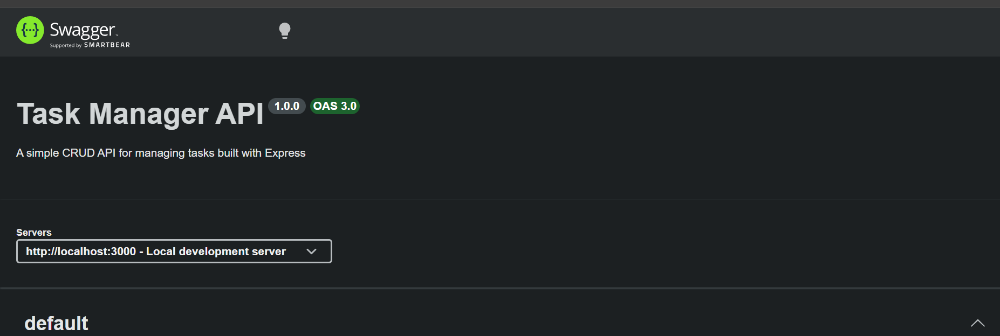
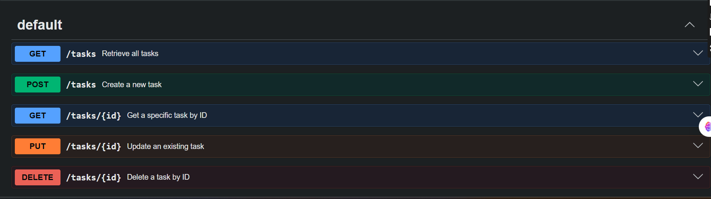

Here is a clean, comprehensive `README.md` block designed specifically for Stage 5. It details the Swagger UI implementation, the OpenAPI configuration, and provides clear guidance on how to navigate the interactive documentation.

---

# Stage 5 — See it: Swagger UI

This stage transitions the API from a terminal-driven application to a visually documented, interactive web service. By leveraging the OpenAPI 3.0 specification and mounting Swagger middleware, developers and clients can interactively execute full CRUD cycles directly from a browser.

---

## 📦 Dependencies Added

To serve the interactive documentation interface, the following package was integrated into the Express application pipeline:

* **`swagger-ui-express`**: Spins up the visual UI assets and serves them on a designated Express route.

---

## 🗺️ Architectural Implementation

1. **`openapi.json`**: A structured definition file mapping out authentication, server URLs, schemas, request payloads, query parameter formats, and every expected HTTP status code return mapping (`200`, `201`, `400`, `404`).
2. **Middleware Mounting**: The definition file is parsed locally and routed via Express:
```javascript
app.use('/docs', swaggerUi.serve, swaggerUi.setup(swaggerDocument));

```


---

## 🚀 Live Verification & The CRUD Cycle

Instead of escaping JSON strings over `curl` inside Windows PowerShell, the API can now be fully tested at the following local web interface:

👉 **`http://localhost:3000/docs`**

### Interactive Sandbox Checklist

Inside the UI dashboard, you can open any endpoint accordion block, click **"Try it out"**, fill out the interactive fields, and hit **"Execute"** to verify:

* **`POST /tasks`**: Supply a JSON body payload to watch the server validate input strings and dynamically calculate the upcoming ID.
* **`GET /tasks`**: Retrieve the active state of the task array instantly.
* **`GET /tasks/{id}`**: Pass an active or non-existent integer route parameter to verify `200 OK` or `404 Not Found` branches.
* **`PUT /tasks/{id}`**: Toggle completion booleans or update text fields cleanly.
* **`DELETE /tasks/{id}`**: Purge records instantly and observe the clean `204 No Content` response status.

---

## 📸 Interface Preview

